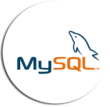

## Implementazione di API RESTful utilizzando API ChatGPT di OpenAI. 
Il progetto è stato realizzato per l'esame di Sicurezza delle Architetture Orientate ai Servizi.
Il progetto include le seguenti funzionalità:
* Registrazione tramite query al DBMS mySql 8.0;
* Login tramite query al DBMS mySql 8.0;
* Gestione autenticazione tramite JWT (JSON Web Token) di validità di un'ora;
* Chiamata all'API di openAI utilizzando il **modello gpt-3.5-turbo** per ottenere risposte a domande o eseguire altre operazioni basate su intelligenza artificiale.

## API Flowchart

## Requisiti
- OpenAI API key (https://platform.openai.com/api-keys) salvata come variabile di ambiente di sistema **OPENAI_API_KEY**
- Java 21 (o successivo), da [SDKman](https://sdkman.io) (installarlo ad esempio con il comando `sdk u java 21.0.2-open`)
- my-sql
- Postman

## Tecnologie
* Spring Boot 3.0
* Spring Security
* JSON Web Tokens (JWT)
* BCrypt
* Maven

## Tools usati

<table align="center">
  <tr>
    <td align="center" width="100">
       
      Java
    </td>
    <td align="center" width="100">
       
      Maven
    </td>
    <td align="center" width="100">
       
      Spring Boot
    </td>

  </tr>
  <tr>
      <td align="center" width="100">
       
      SdkMan
    </td>
  <td align="center" width="100">
       
      Mysql 8.0
    </td>
	  <td align="center" width="100">
       
      Postman
    </td>
  </tr>
</table>

## Dipendenze necessarie
Bisogna inserire le seguenti dipendenze nel proprio file pom.xml
* Dipendenze attuali nel pom.xml
* spring-boot-starter-parent
* spring-boot-starter-security
* jjwt
* jaxb-api
* spring-boot-starter-web
* jakarta.persistence-api
* spring-boot-starter-test
* spring-security-test
* json-path
* spring-boot-starter-data-jpa
* mysql-connector-java

## Utilizzo 
Per prima cosa bisogna creare una chiave openAI al seguente link (https://platform.openai.com/api-keys) ed inserirla come variabile d'ambiente:
[VARIABILE AMBIENTE] (immagini/variabileAmbiente.png)

Successivamente esegui il progetto utilizzando `./mvnw spring-boot:run` e apri postman per poter chiamare i diversi endpoint.

Una volta che l'applicazione è attiva e funzionante è necessario registrarsi, se non si hanno le credenziali, all'endpoint `http://localhost:8080/register` inserendo username e password per poi successivamente effettuare la login
all'endpoint `http://localhost:8080/auth/login`.
Successivamente, dopo aver staccato il token, è possibile interagire con il *ChatBot* effettuando richieste HTTP GET al endpoint configurato nella classe Controller aggiungendo semplicemente il messaggio di testo come parametro di query all'URL, in questo modo:

`http://localhost:8080/chat?userInput="Cosa significa maneskin?"`
ed inserire nell'headers una key con valore "Authorization" e come value il token staccato nell'api della login.
Riceverai una risposta dal chatbot! 

